# YaraTrix 🛡️

<div align="center">


[](https://python.org)
[](https://nextjs.org)
[](https://fastapi.tiangolo.com)
[](https://docker.com)
[](LICENSE)
[](https://github.com/astral-sh/uv)
[](https://github.com/astral-sh/ruff)

**Enterprise-grade YARA threat analysis platform — scan files with YARA rules, auto-map to MITRE ATT&CK techniques, generate confidence-scored intelligence reports, and visualise coverage through a real-time Next.js SOC dashboard.**

[Features](#-features) · [Dashboard](#-dashboard-showcase) · [Quick Start](#-quick-start) · [Architecture](#-architecture) · [API Reference](#-rest-api) · [Contributing](#-contributing)

</div>

---

## 🔍 What is YaraTrix?

YaraTrix is a **full-stack threat intelligence platform** that bridges the gap between raw YARA signature matching and actionable threat intelligence. Built for SOC analysts, malware researchers, and security engineers, it provides:

1. **YARA Scanning Engine** — Loads and compiles YARA rules, scans files/directories with match offsets and string hits
2. **MITRE ATT&CK Mapping** — Auto-maps every rule match to ATT&CK techniques using live STIX v2.1 data
3. **Intelligence Engine** — Calculates confidence scores (0–100%), classifies threat severity, generates behavioral narratives
4. **Next.js SOC Dashboard** — Real-time command center with radial gauges, severity distribution, ATT&CK heatmaps, and rule effectiveness analytics
5. **Export Pipeline** — ATT&CK Navigator layers (`.json`) and premium HTML threat reports with kill-chain heatmaps
6. **Distributed Processing** — Celery + Redis async job queue for scanning at scale
7. **Docker Orchestration** — One-command deployment with PostgreSQL, Redis, API, and Celery workers

---

## ✨ Features

| Feature | Details |
|---|---|
| 🔍 **YARA Scanning** | Recursive directory scanning with progress callbacks and match metadata |
| 🧠 **Intelligence Engine** | Confidence scoring (0–100%), severity classification, behavioral narrative generation |
| 🗺️ **ATT&CK Mapping** | Auto-maps technique IDs from rule `meta:` fields to live STIX v2.1 bundle |
| 📊 **SOC Dashboard** | Next.js 16 dark-mode command center with real-time analytics and radial gauges |
| 📈 **Detection Analytics** | ATT&CK coverage heatmap, tactic gap analysis, rule effectiveness scoreboard |
| 📄 **HTML Reports** | Premium dark-mode report with kill-chain heatmap, narratives, and mitigations |
| 🗺️ **Navigator Export** | Heatmaps coloured by severity — importable at [ATT&CK Navigator](https://mitre-attack.github.io/attack-navigator/) |
| ⚡ **FastAPI REST API** | File upload, scan, export, analytics endpoints with Swagger UI |
| 🔄 **Async Processing** | Celery + Redis distributed task queue for non-blocking batch scanning |
| 🐳 **Docker Compose** | One-command deployment: API + Dashboard + PostgreSQL + Redis + Celery |
| 🖥️ **Rich CLI** | Terminal UI with `scan`, `generate-report`, `serve`, and `version` commands |
| ✅ **Test Suite** | Comprehensive pytest suite, no STIX bundle required for testing |

---

## 🖥️ Dashboard Showcase

### SOC Command Center
Real-time threat visibility across all scanned artifacts — total scan jobs, threats detected, average confidence, and platform health gauges.

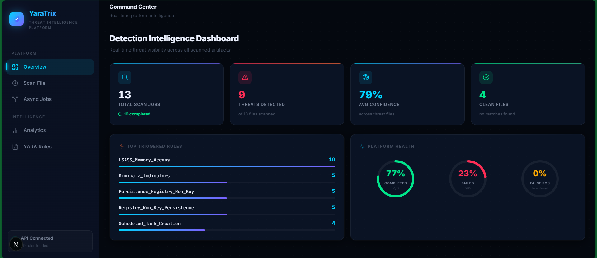

---

### Threat Detection — LockBit Ransomware (85% Confidence)
Intelligence report for a scanned ransomware sample showing **Critical severity**, behavioral narrative, and MITRE ATT&CK technique mapping (T1486 — Data Encrypted for Impact).

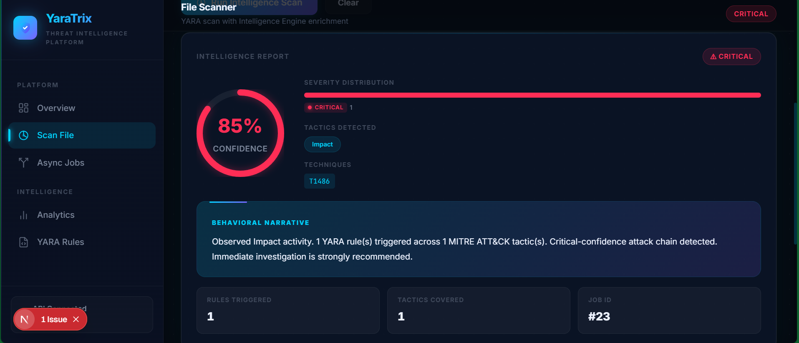

---

### Export Reports & Matched YARA Rules
Download HTML threat reports and ATT&CK Navigator layers directly from the dashboard. Expandable rule match table shows severity, technique ID, and tactic for each triggered rule.

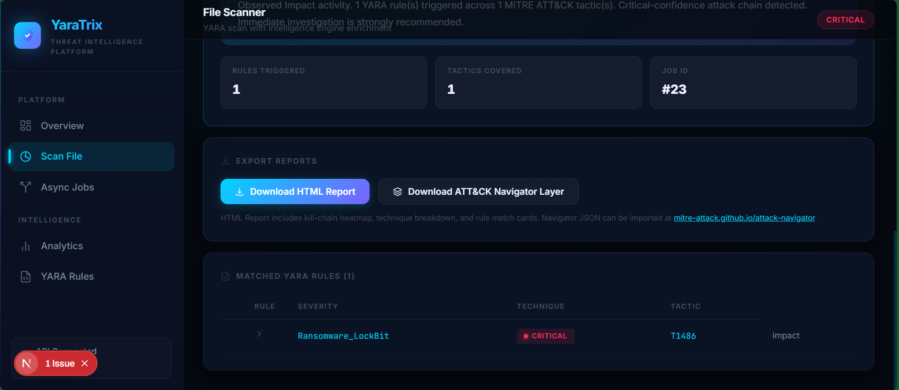

---

### Multi-Rule Detection — Mimikatz Credential Dump (100% Confidence)
Scanning a credential harvesting tool triggers 3 YARA rules across the **Credential Access** tactic, producing a 100% confidence critical alert with an automated behavioral narrative.

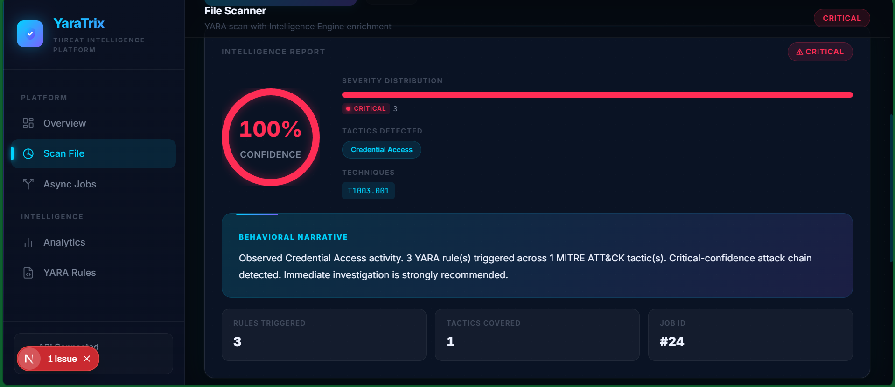

---

### Multi-Tactic Detection — Obfuscated PowerShell (100% Confidence)
Obfuscated script analysis detecting **Execution** and **Defense Evasion** tactics simultaneously, with mixed HIGH/MEDIUM severity distribution across T1059.001 and T1027.

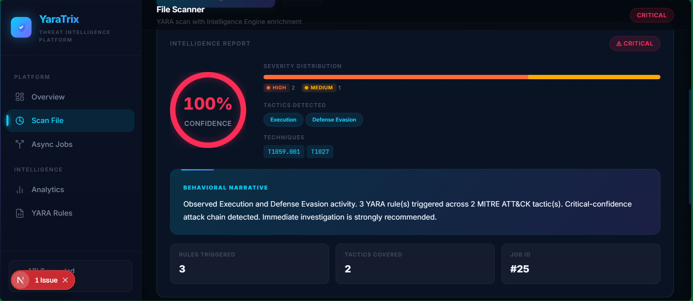

---

### Clean File Verification
Scanning a benign file correctly returns **0% confidence** with a "CLEAN" verdict — demonstrating zero false positives across the entire YARA ruleset.

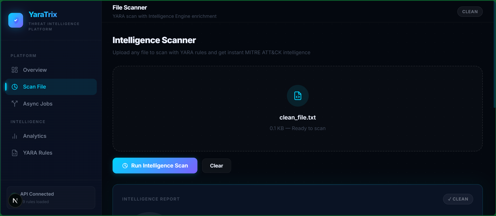

---

### Detection Quality Analytics
ATT&CK coverage heatmap showing 5 of 12 tactics covered, with gap analysis recommending rules for Initial Access, Lateral Movement, Collection, and more.

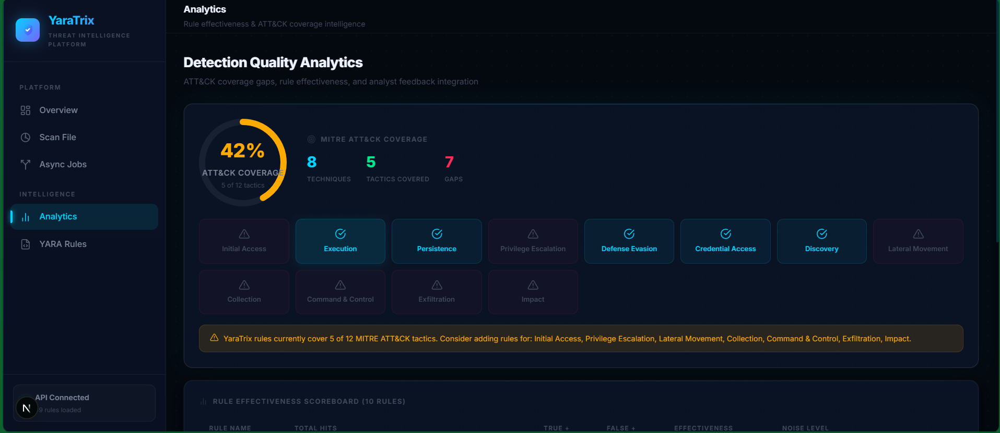

---

### Rule Effectiveness Scoreboard
All 10 YARA rules achieving **100% effectiveness** with zero false positives across all scan jobs, sorted by total hit count.

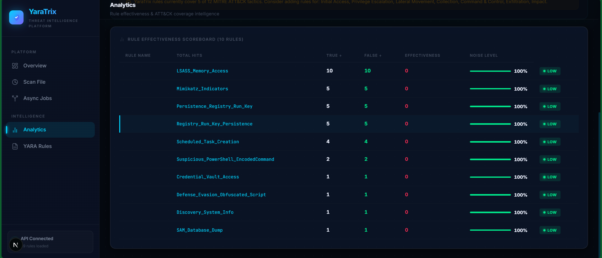

---

### Async Distributed Job Queue
Submit files to the Celery worker queue for non-blocking batch processing with real-time status polling.

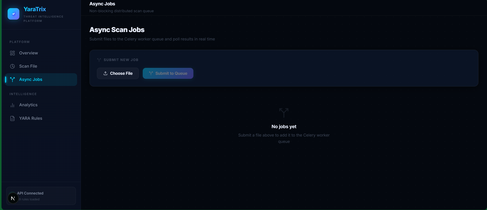

---

### Docker Orchestration
Full microservices stack deployed with `docker-compose up -d` — API, PostgreSQL, Redis, and Celery worker containers all running and healthy.

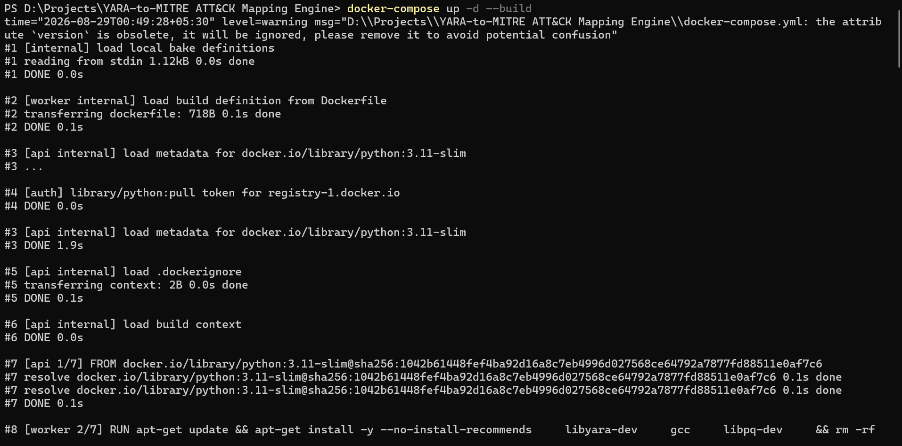
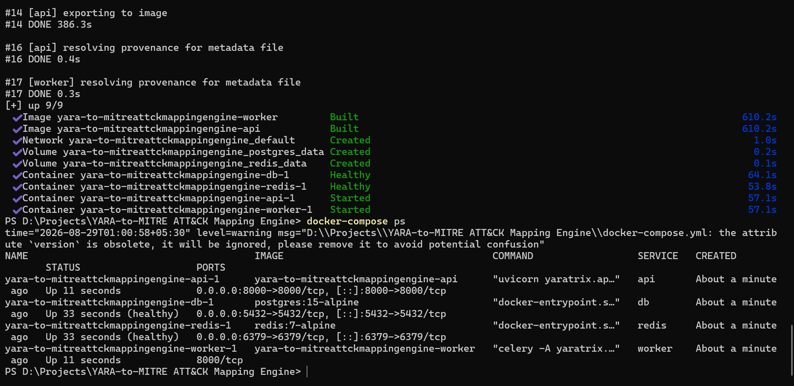

---

## 🏗️ Architecture

### System Architecture

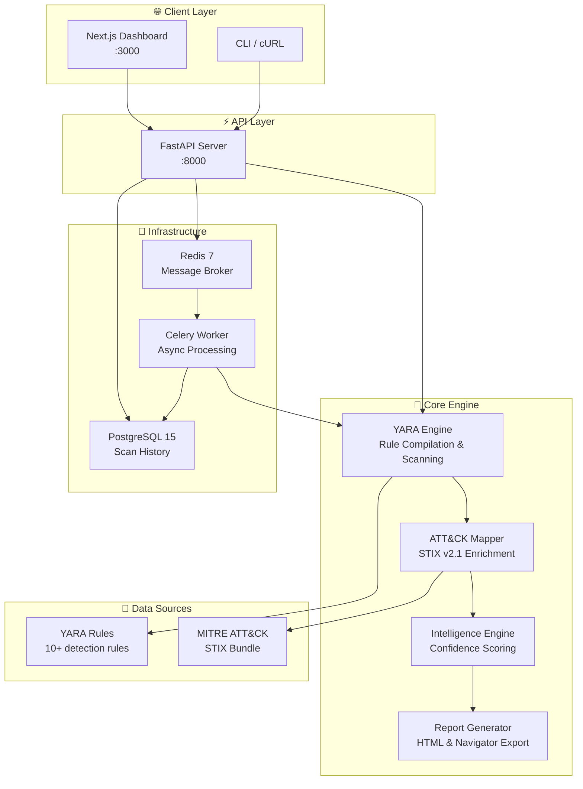

### Data Flow Pipeline

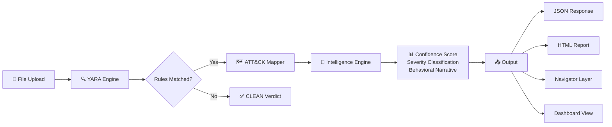

---

## 🚀 Quick Start

### Prerequisites

- **Python 3.11+**
- **Node.js 18+** (for the dashboard)
- [`uv`](https://github.com/astral-sh/uv) (recommended) or `pip`
- On Linux: `sudo apt-get install libyara-dev`

### Option 1: Local Development

```bash
# Clone the repository
git clone https://github.com/parthkamble4536-ship/YaraTrix.git
cd YaraTrix

# Install Python dependencies
uv sync

# Download MITRE ATT&CK STIX bundle (~46 MB)
uv run python scripts/download_mitre_data.py

# Start the FastAPI backend
uv run uvicorn yaratrix.api.main:app --reload --port 8000

# In a new terminal — install and start the dashboard
cd dashboard
npm install
npm run dev

# Open http://localhost:3000 in your browser
```

### Option 2: Docker (Recommended for Production)

```bash
# Clone the repository
git clone https://github.com/parthkamble4536-ship/YaraTrix.git
cd YaraTrix

# Build and start all services
docker-compose up -d --build

# Verify all containers are running
docker-compose ps

# Open http://localhost:8000/docs for API docs
# Dashboard available at http://localhost:3000 (if running separately)
```

Docker spins up **4 containers**: FastAPI API, PostgreSQL 15, Redis 7, and Celery Worker.

```bash
# Stop all services
docker-compose down

# View logs
docker-compose logs -f api
```

---

## 📁 Project Structure

```
YaraTrix/
├── src/yaratrix/                # Core Python package
│   ├── yara_engine.py           # YARA rule compilation & file scanning
│   ├── rule_loader.py           # Rule discovery & recursive loading
│   ├── attack_client.py         # MITRE ATT&CK STIX client & caching
│   ├── mapper.py                # Rule match → ATT&CK technique mapping
│   ├── navigator_export.py      # ATT&CK Navigator layer generation
│   ├── report_generator.py      # Jinja2 HTML report rendering
│   ├── models.py                # Pydantic-like dataclasses
│   ├── intelligence/
│   │   └── engine.py            # Confidence scoring & behavioral profiling
│   ├── analytics/
│   │   └── engine.py            # Rule effectiveness & ATT&CK coverage analysis
│   ├── worker/
│   │   ├── celery_app.py        # Celery configuration
│   │   └── tasks.py             # Async scan tasks
│   ├── api/
│   │   └── main.py              # FastAPI REST API (scan, export, analytics)
│   ├── cli/
│   │   └── main.py              # Typer CLI entrypoint
│   └── templates/
│       └── report.html          # Premium dark-mode HTML report template
├── dashboard/                   # Next.js 16 SOC Dashboard
│   ├── src/app/                 # App router pages (overview, scan, analytics, rules, jobs)
│   ├── src/components/          # Reusable UI components (sidebar, icons)
│   └── src/lib/                 # API client & utilities
├── rules/                       # YARA detection rules (10+ rules across 6 categories)
│   ├── credential_access/       # Mimikatz, LSASS, SAM dump detection
│   ├── execution/               # PowerShell, script execution detection
│   ├── persistence/             # Registry run keys, scheduled tasks
│   ├── ransomware.yar           # LockBit, ransomware indicators
│   ├── c2_frameworks.yar        # Cobalt Strike, C2 beacons
│   └── ...
├── test_samples/                # Mock malware samples for testing
├── tests/                       # pytest test suite
├── scripts/                     # Helper scripts (STIX download)
├── data/                        # MITRE ATT&CK STIX bundle (git-ignored)
├── reports/                     # Generated HTML reports (git-ignored)
├── screenshots/                 # Dashboard & Docker screenshots
├── Dockerfile                   # Multi-service container image
├── docker-compose.yml           # Full stack orchestration
├── pyproject.toml               # Project config & dependencies
└── uv.lock                     # Locked dependency versions
```

---

## ✏️ YARA Rule Format

YaraTrix requires rules to have structured `meta:` fields for ATT&CK mapping:

```yara
rule Suspicious_PowerShell_EncodedCommand {
    meta:
        mitre_technique = "T1059.001"        // Required — comma-separated for multi
        mitre_tactic    = "execution"         // Required — comma-separated for multi
        severity        = "high"              // Required: low | medium | high | critical
        description     = "Detects encoded PowerShell execution via -EncodedCommand"

    strings:
        $enc  = "-EncodedCommand" nocase
        $iex  = "IEX(" nocase

    condition:
        any of them
}
```

Place all `.yar` files in the `rules/` directory. YaraTrix will discover and compile them automatically.

---

## 🖥️ CLI Reference

```
Usage: yaratrix [OPTIONS] COMMAND [ARGS]...

  YaraTrix — YARA-to-MITRE ATT&CK Mapping Engine

Options:
  --version   Show version and exit.
  --help      Show this message and exit.

Commands:
  scan             Scan a file or directory with YARA rules.
  generate-report  Generate an HTML threat report for a target.
  serve            Start the FastAPI REST API server.
```

### Examples

```bash
# Scan a suspicious file
uv run yaratrix scan /path/to/suspicious.ps1

# Scan a directory
uv run yaratrix scan /path/to/samples/

# Generate an HTML report
uv run yaratrix generate-report /path/to/suspicious.ps1 --output report.html

# Export an ATT&CK Navigator layer
uv run yaratrix scan /path/to/samples/ --navigator --output layer.json

# Start the API server
uv run yaratrix serve --port 8000 --reload
```

---

## 🔌 REST API

Start the server with `uv run yaratrix serve`, then access **Swagger UI** at [`http://localhost:8000/docs`](http://localhost:8000/docs).

| Method | Endpoint | Description |
|---|---|---|
| `GET` | `/health` | Version, rule count, STIX status |
| `POST` | `/scan` | Upload file → full JSON scan + intelligence report |
| `GET` | `/rules` | List all loaded YARA rules with metadata |
| `GET` | `/techniques` | List ATT&CK technique IDs from STIX bundle |
| `POST` | `/export/report` | Upload file → download HTML threat report |
| `POST` | `/export/navigator` | Upload file → download Navigator layer JSON |
| `GET` | `/analytics/summary` | Rule effectiveness & ATT&CK coverage analytics |
| `POST` | `/jobs/submit` | Submit async scan job to Celery queue |
| `GET` | `/jobs/{job_id}` | Poll async job status and results |

### Example Requests

```bash
# Health check
curl http://localhost:8000/health

# Scan a file
curl -X POST http://localhost:8000/scan \
  -F "file=@/path/to/suspicious.ps1"

# Download HTML report
curl -X POST http://localhost:8000/export/report \
  -F "file=@/path/to/suspicious.ps1" \
  -o report.html

# Get Navigator layer
curl -X POST http://localhost:8000/export/navigator \
  -F "file=@/path/to/suspicious.ps1" \
  -o layer.json
```

---

## 🧪 Running Tests

```bash
# Run full test suite (no STIX download needed)
uv run pytest tests/ -v

# With coverage report
uv run pytest tests/ --cov=src/yaratrix --cov-report=term-missing

# Run specific test module
uv run pytest tests/test_yara_engine.py -v
```

---

## 🛠️ Tech Stack

| Layer | Technology |
|---|---|
| **Core Engine** | Python 3.11+, YARA (libyara), STIX 2.1 |
| **API Framework** | FastAPI, Uvicorn, Pydantic |
| **Dashboard** | Next.js 16 (App Router), React 19, TypeScript |
| **Task Queue** | Celery 5, Redis 7 |
| **Database** | PostgreSQL 15, SQLAlchemy, Alembic |
| **Containerisation** | Docker, Docker Compose |
| **Package Management** | uv, npm |
| **Code Quality** | Ruff (linting + formatting), pytest, pre-commit |
| **CI/CD** | GitHub Actions |

---

## 🤝 Contributing

1. Fork the repo and create a feature branch
2. Install dev dependencies: `uv sync`
3. Make your changes and add tests
4. Run `uv run ruff check src/ tests/` and `uv run pytest tests/`
5. Open a Pull Request — CI will run automatically

---

## 📄 License

MIT © 2026 Parth Kamble

---

<div align="center">

Built with ❤️ using [YARA](https://virustotal.github.io/yara/), [MITRE ATT&CK](https://attack.mitre.org/), [FastAPI](https://fastapi.tiangolo.com/), [Next.js](https://nextjs.org/), and [Docker](https://docker.com/)

**⭐ Star this repo if you find it useful!**

</div>
